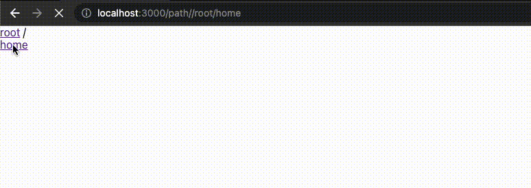

# Installing the BreadCrumb_FileBrowser


## To run the project 
### 1. In the Server directory, you can run:
```
> cd server
> npm install
> npm start

The Server Runs on http://localhost:8000
```

### 2. In the Client directory, you can run:
```
> cd client
> npm install
> npm start

The Client Runs on http://localhost:3000
```
## Demo:

\
Runs the app in the development mode.\
Open [http://localhost:3000](http://localhost:3000) to view it in your browser.

This project was created by : \
Piyush Himmatsinghka : https://github.com/phsinghka/BreadCrumb_FileBrowser